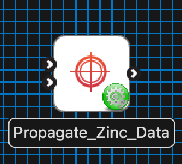
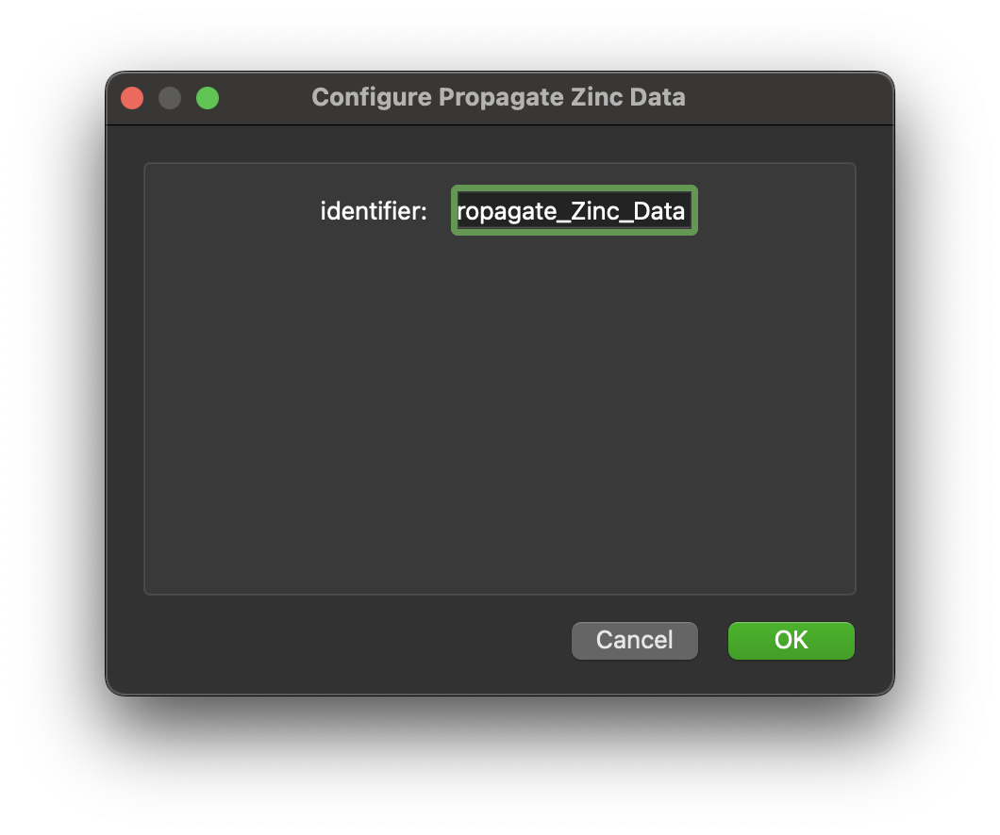

Propagate Zinc Data
===================

Overview
--------

The **Propagate Zinc Data** is MAP Client plugin for propagating Zinc data across a mesh.
This step works with file locations that are nominally EXF files to propagate data defined over datapoints in groups to similarly named groups in the mesh.
The first file location is the mesh input to propagate the mesh over and the second input is the data to propagate over the mesh.
Propagation will only occur if both the data, which is defined in datapoints, and the mesh have the same groups defined.

Workflow Connections
--------------------

As shown in :numref:`fig-mcp-propagate-zinc-data-workflow-connections`, the **Propagate Zinc Data** requires two file location inputs.

It produces one output, a file location, which may be piped to other workflow steps:

.. _fig-mcp-propagate-zinc-data-workflow-connections:

   **Propagate Zinc Data** workflow connections.

Information on this plugins' specification is available :ref:`here <mcp-propagate-zinc-data-specification>`.

Configuration
-------------

This step does have any configuration options other than setting the step identifier.

.. _fig-mcp-propagate-zinc-data-configure-dialog:

   **Propagate Zinc Data** step configuration dialog.

Instructions
------------

This is a non-interactive step.
See `Configuration`_.

.. toctree::
  :hidden:
  :caption: Propagate Zinc Data
  :maxdepth: 1

  specification.rst
